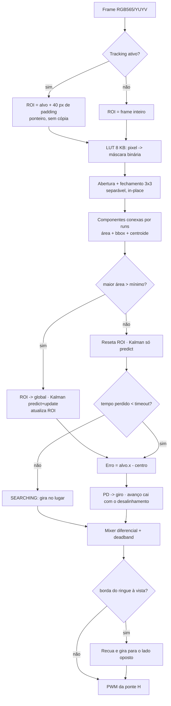

# Pipeline de visão do robô de sumô

Rastreabilidade entre `computer_vision_diagram_sumo.bpmn` e o código, mais as
decisões de implementação que se afastam do diagrama e por quê.

- [Mapeamento BPMN → código](#mapeamento-bpmn--código)
- [Desvios conscientes do diagrama](#desvios-conscientes-do-diagrama)
- [Fluxo real](#fluxo-real)
- [Orçamento de tempo e memória](#orçamento-de-tempo-e-memória)
- [Calibração](#calibração)

## Mapeamento BPMN → código

| Elemento BPMN | Onde está | Observação |
|---|---|---|
| `StartEvent_Init` (câmera, exposição/WB fixos) | `platform/linux/v4l2_source.cpp:129` · `platform/esp32/esp32_cam_source.cpp:21` | Exposição, ganho e AWB travados; sem isso o limiar calibrado deixa de valer quando o oponente entra no quadro |
| `Gateway_Tracking` (tracking ativo?) | `RoiTracker::current` em `include/ecv/vision/roi.hpp:24` | |
| `Task_CropROI` (crop com padding) | `crop()` em `src/core/types.cpp:23` | Aritmética de ponteiro, zero cópia |
| `Task_FullFrame` | mesmo `crop()` com a ROI = frame inteiro | Um único caminho de código para os dois ramos |
| `Task_ColorConvert` (BGR→HSV) | `rgb_to_hsv` em `include/ecv/vision/color.hpp:70` | Fundido com o limiar; ver desvio 1 |
| `Task_Threshold` (`inRange`) | `threshold_lut` / `threshold_hsv` em `src/vision/threshold.cpp` | |
| `Task_Morph` (abertura/fechamento 3x3) | `src/vision/morphology.cpp` | Separável e in-place |
| `Task_FindContours` | `find_blobs` em `src/vision/blobs.cpp:40` | Rotulagem por runs; ver desvio 2 |
| `Gateway_Area` (área > mínima?) | parâmetro `min_area` de `find_blobs` | |
| `Task_Centroid` (momentos) | acumulado dentro de `find_blobs` | Momentos de ordem 0 e 1 saem de graça na mesma passada |
| `Task_CoordConvert` (ROI → global) | `RoiTracker::to_global` em `include/ecv/vision/roi.hpp:48` | |
| `Task_UpdateROI` | `RoiTracker::update` | |
| `Task_ResetTracking` | `RoiTracker::reset` | |
| `Task_Kalman` | `include/ecv/track/kalman.hpp` | Dois filtros de 2 estados; ver desvio 3 |
| `Task_ErrorCalc` (`E = X_alvo − X_centro`) | `src/app/sumo_vision.cpp:144` | Normalizado para [-1, 1] |
| `Task_PDControl` | `include/ecv/control/pd.hpp` | PD com derivada filtrada |
| `EndEvent_PWM` (ponte H) | `DifferentialMixer` + `MotorSink` | `platform/linux/pwm_sink.cpp` e `platform/esp32/ledc_motor_sink.cpp` |

## Desvios conscientes do diagrama

**1. Conversão de cor e limiarização são um estágio só.**
Separados, seria preciso um buffer HSV de 3 B/px (225 KB em 320x240, mais que a
DRAM interna do ESP32) e uma segunda varredura da imagem. Fundidos, o HSV vive
em registrador. Em RGB565 a conversão some de vez: uma LUT de 8 KB indexada pelo
próprio pixel responde se ele é do alvo — medido em **11,9x mais rápido** que
calcular HSV por pixel (`apps/bench`, 320x240, x86_64).

**2. `findContours` virou rotulagem de componentes conexas.**
O contorno nunca é usado: o robô precisa de área, bounding box e centroide. A
rotulagem por run-length com union-find entrega os três exatos numa passada e
sem alocar vetor de pontos por contorno — que é justamente o que estoura a heap
de um microcontrolador. Conectividade 8, como o `findContours` com
`CHAIN_APPROX_SIMPLE`.

**3. O Kalman também é alimentado quando HÁ detecção.**
Na BPMN o filtro só aparece no ramo de falha. Um filtro que nunca recebe medida
não tem estado para prever: a velocidade estimada vem exatamente da sequência de
acertos. Aqui ele roda `predict + update` em todo frame com alvo e só `predict`
quando o alvo some. Depois de `coast_timeout_s` sem medida o estado é
invalidado — extrapolar velocidade velha produz alvo fantasma.

**4. Borda do ringue entrou como estágio novo.**
Não está na BPMN, mas sair do dohyo perde a luta independentemente de onde está
o oponente. `scan_lines` varre 4 linhas horizontais (1.280 px contra 76.800) e
sobrepõe o comando de ataque com um recuo. Desligado por padrão
(`SumoConfig::border_enabled`) porque exige calibrar o branco do dohyo.

## Fluxo real



## Orçamento de tempo e memória

Medido com `just bench` nesta máquina (x86_64, GCC 16, `-O2`). Serve como razão
entre estágios, **não** como previsão para o alvo embarcado — rodar o mesmo
binário no RPi e o `example_main` no ESP32 para ter o número que vale.

| Estágio (320x240) | Frame cheio | Dentro da ROI |
|---|---:|---:|
| Limiarização por LUT | 128 µs | ~29 µs |
| Limiarização calculando HSV | 1526 µs | — |
| Morfologia (abertura) | 225 µs | ~107 µs |
| Componentes conexas | 87 µs | ~21 µs |
| Rastreio + controle | < 1 µs | < 1 µs |
| **Pipeline completo** | **645 µs** | **156 µs (pior caso 206 µs)** |

A ROI dinâmica dá 4,1x em 320x240 e 8,3x em 640x480 — quanto maior o frame,
maior o ganho, porque a ROI acompanha o alvo, não a resolução.

Memória estática de `SumoStorage<320,240>`: **98.116 B**, sendo 76.800 de
máscara, 8.193 da LUT e 13.123 da workspace de rotulagem. Nenhuma alocação
dinâmica depois da inicialização — o pipeline inteiro opera sobre buffers do
chamador.

## Testar com uma câmera de verdade

`ecv_probe` roda o pipeline inteiro sobre uma câmera V4L2 e desenha o resultado
no terminal — caixa amarela no alvo, cruz vermelha no centroide, retângulo azul
na ROI, linha cinza no centro do quadro. Sem GUI, então funciona igual por SSH
num Raspberry Pi já montado no robô.

```bash
just cam-list                      # que formatos a câmera aceita
just probe                         # `c` calibra no centro e aplica na hora
just probe --border --log e.csv    # borda do ringue + uma linha por frame
just probe --no-preview            # terminal sem truecolor, ou link lento
```

Teclas durante a execução (`c` calibra · `m` máscara · `b` borda · `e` exposição
· `r` reset · `+`/`-` área mínima · `s` salva PPM · `q` sai) existem para não
reiniciar o programa no meio de um teste — reiniciar joga fora a exposição já
estabilizada da câmera e muda o que se está medindo.

O roteiro de bancada, com critério de passa/falha por funcionalidade, está em
[`TESTES_MANUAIS.md`](TESTES_MANUAIS.md).

Só modos **YUYV**, **RGB565**, **RGB24** e **BGR24** servem: MJPG é fluxo
comprimido e decodificar JPEG por frame custaria mais que o pipeline todo.
`--list` marca com `*` o que o núcleo decodifica.

Duas armadilhas de webcam USB:

- **Exposição automática.** Por padrão o probe deixa o automático ligado, porque
  ajuda a explorar. O robô roda com `--lock-exposure`: com AE/AWB ligados, o
  oponente entrando no quadro muda o brilho da cena inteira e a faixa calibrada
  deixa de valer. Calibre com a trava ligada, do jeito que vai competir.
- **YUYV custa mais que RGB565.** A LUT de cor rende 11,9x em RGB565 (o pixel é
  o índice da tabela) mas só 2,0x em YUYV, que ainda precisa de YUV→RGB e
  quantização por pixel. Medido: 128 µs contra 738 µs por frame cheio de
  320x240. Não é problema num laptop ou RPi; é o motivo de o ESP32-CAM usar
  RGB565 direto do sensor.

## Calibração

Com câmera: `just cam-calibrate` usa o quarto central do quadro (é onde se põe o
alvo) e imprime o `--range` pronto. `--rect x,y,w,h` escolhe outra região.

A partir de uma imagem salva:

1. `just probe --snapshot /tmp/alvo.ppm` (ou `ecv_sumo_sim --dump` na simulação)
2. Abrir o PPM e anotar o retângulo do marcador do oponente.
3. `just calibrate /tmp/alvo.ppm <x> <y> <w> <h>`
4. Colar o `HsvRange` impresso e conferir a taxa de falsos positivos que o
   programa reporta. Acima de ~1%, a cor do marcador não é separável da cena e
   nenhum ajuste de morfologia resolve.

O retângulo pode ser folgado: pixels com saturação abaixo de 40 ficam fora do
histograma de matiz (o matiz de um cinza é ruído de divisão), e os limites de S
e V são medidos só sobre os pixels que caíram no arco de matiz escolhido. A
faixa ainda recebe ±3 de margem no matiz, porque a iluminação da competição não
é a da foto. Se o aviso de "pouca cor definida" aparecer, o recorte pegou mais
fundo que alvo.

A estimativa vive em `include/ecv/vision/calibrate.hpp` — histograma, sem
ordenar e sem alocar — justamente para poder rodar no robô, na hora, com a luz
do dia da competição.

O retângulo pode ser folgado: pixels com saturação abaixo de 40 ficam fora do
histograma de matiz (o matiz de um cinza é ruído de divisão), e os limites de S
e V são medidos só sobre os pixels que caíram no arco de matiz escolhido. A
faixa ainda recebe ±3 de margem no matiz, porque a iluminação da competição não
é a da foto. Se o aviso de "pouca cor definida" aparecer, o recorte pegou mais
fundo que alvo.
